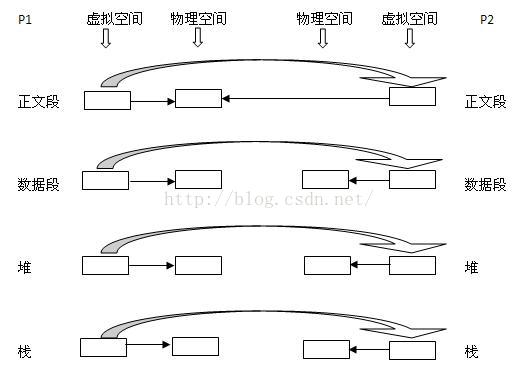

# linux-API

## fork

头文件unistd.h

```
pid_t fork(void);
```

- pid_t: 成功调用则返回两个值，子进程返回0，父进程返回子进程返回`子进程ID`;否则，出错返回-1.


 

从图中我们可以看出除了正文段外，子进程的所有其它段都分配了物理空间，并将父进程的相关内容拷贝过来。父进程的task_struct结构中的打开文件描述符，进程组ID，。

关于父子进程共享文件描述符

如果一个进程打开了一个文件以后，创建子进程，子进程会继承父进程的环境和**上下文**中的大部分内容，包括文件描述符。此时父子进程享有相同的文件偏移量，执行相同的程序读取文件中的字符。程序执行结果是随机的，可能是父进程先读，产生一个偏移，再由子进程读其相邻字符，也可能结果相反。 

```C++
#include <stdio.h>
#include <stdlib.h>
#include <unistd.h>
#include <sys/types.h>
#include <pthread.h>
#include <assert.h>
#include <iostream>

using namespace std;

int main()
{
    cout << "程序开始运行" << endl;

    //创建子进程
    pid_t pid = fork();
    cout << "after fork()" << endl;  //子进程从这里开始执行的
    if (pid == 0)
    {
        cout << "子进程创建" << endl;
    }
    else if (pid > 0)
    {
        cout << "父进程创建" << endl;
        sleep(2);
    }
    else
    {
        cout << "进程创建失败" << endl;
    }

    cout << "程序运行结束" << endl;
    return 0;
}
```

输出：

```
程序开始运行
after fork()
父进程创建
after fork()
子进程创建
程序运行结束
程序运行结束
```

相关的一些函数

```
getpid() //获取进程id
getppid() //获取父进程id
```

## vfork

头文件：`unistd.h`

```
pid_t vfork(void); 
```

vfork()函数也用于创建一个新进程，vfork创建的子进程与父进程共享数据段。

- vfork创建的进程保证子进程先运行，只有子进程通过exec或者exit之后走，父进程才能运行。

```C++
#include <stdio.h>
#include <stdlib.h>
#include <unistd.h>
#include <sys/types.h>
#include <pthread.h>
#include <assert.h>
#include <iostream>

using namespace std;
int main()
{
    int num = 1;
    int pid = vfork();
    if (pid == 0)
    {
        num = 2;
        cout << "创建子进程" << endl;
        exit(1);
    }
    else if (pid > 0)
    {
        // num = 3;
        cout << "创建父进程" << endl;

        cout << "num:" << num << endl; //输出2
    }
    else
    {
        cout << "进程创建失败" << endl;
    }
    return 0;
}
```

### 为什么会有fork

因为以前的fork当它创建一个子进程时，将会创建一个新的地址空间，并且拷贝父进程的资源，而往往在子进程中会执行exec调用，这样，前面的拷贝工作就是白费力气了，这种情况下，聪明的人就想出了vfork，它产生的子进程刚开始暂时与父进程共享地址空间（其实就是线程的概念了），因为这时候子进程在父进程的地址空间中运行，所以子进程不能进行写操作，

并且在儿子“霸占”着老子的房子时候，要委屈老子一下了，让他在外面歇着（阻塞），一旦儿子执行了exec或者exit后，相当于儿子买了自己的房子了，这时候就相当于分家了。此时vfork保证子进程先运行，在她调用exec或exit之后父进程才可能被调度运行。 

## clone

Linux上创建线程一般使用的是pthread库 实际上linux也给我们提供了创建线程的系统调用，就是clone 

clone可以让你有选择性的继承父进程的资源，你可以选择想vfork一样和父进程共享一个虚存空间，从而使创造的是线程，你也可以不和父进程共享，你甚至可以选择创造出来的进程和父进程不再是父子关系，而是兄弟关系。 

没有复制的数据结构则通过指针的复制让子进程共享（arg）,具体要复制的资源，则可以通过flags进行制定，并返回子进程的PID。

头文件: `sched.h`

```
int clone(int (*fn)(void *), void *child_stack, int flags, void *arg);
```

flags:

| Namespace 分类 | 系统调用参数 | 含义                                                   |
| -------------- | ------------ | ------------------------------------------------------ |
| UTS            | CLONE_NEWUTS | 提供了主机名相关的设置                                 |
| Mount          | CLONE_NEWNS  | 提供了文件系统相关的挂载，用于复制和文件系统相关的资源 |
| PID            | CLONE_NEWPID | 提供了独立的进程空间支持                               |
| Network        | CLONE_NEWNET | 提供了网络相关支持                                     |

一个进程主要由四个要素组成：

1.一段需要执行

2.进程自己的专用堆栈空间

3.进程控制块（PCB）

4.进程专有的Namespace

```c++
#include <stdio.h>
#include <malloc.h>
#include <stdlib.h>
#include <sched.h>
#include <signal.h>

#include <sys/types.h>
#include <unistd.h>

#define FIBER_STACK 8192
int a;
void *stack;

int do_something(void *)
{
    printf("This is son, the pid is:%d, the a is: %d\n", getpid(), ++a);
    free(stack); //这里我也不清楚，如果这里不释放，不知道子线程死亡后，该内存是否会释放
    exit(1);
}

int main()
{
    void *stack;
    a = 1;
    stack = malloc(FIBER_STACK); //为子进程申请系统堆栈

    if (!stack)
    {
        printf("The stack failed\n");
        exit(0);
    }
    printf("creating son thread!!!\n");

    clone(&do_something, (char *)stack + FIBER_STACK, CLONE_VM | CLONE_VFORK, 0); //创建子线程

    printf("This is father, my pid is: %d, the a is: %d\n", getpid(), a);
    exit(1);
}
```

## Sleep

头文件：unistd.h

```
sleep(5); //停5秒
```


## exec函数族

夺舍进程

```c++
int execl(const char *path, const char *arg, ...);

int execlp(const char *file, const char *arg, ...);

int execle(const char *path, const char *arg, ..., char *const envp[]);

int execv(const char *path, char *const argv[]);

int execvp(const char *file, char *const argv[]);

int execve(const char *path, char *const argv[], char *const envp[]);
```


- l (list)                           命令行参数列表

- p (path)                       搜素file时使用path变量

- v (vector)                    使用命令行参数数组

- e (environment)       使用环境变量数组,不使用进程原有的环境变量，设置新加载程序运行的环境变量


## sethostname

 这个系统调用能够设置我们的主机名 

```
 int sethostname(const char *name, size_t len); 
```


## chdir

 可以改变我们程序的运行目录 

```
int chdir(const char *path);
```


## chroot

 这个系统调用能够用于设置根目录 

```
int chroot(const char *path);
```


## mount

 这个系统调用用于挂载文件系统 

```
int mount(const char *source, const char *target,
                 const char *filesystemtype, unsigned long mountflags,
                 const void *data);
```


